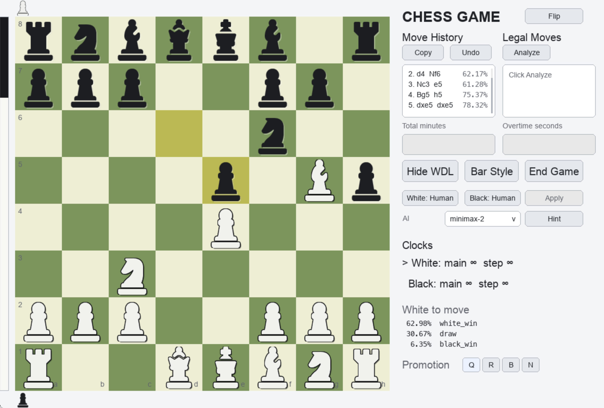

# Chess LC0



Chess LC0 is a compact pygame chess GUI backed by Leela Chess Zero style WDL
evaluation. It can be used as a two-player chess board, a lightweight LC0
position evaluator, or a small playground for greedy and minimax WDL-based AI
move selection.

The app is intentionally small: `game_main.py` is the entrypoint, while the UI,
LC0 wrapper, and sample AI implementations live under `chess_rl/`.

## Features

- Play a local chess game with legal-move validation.
- Optional clocks with main time and per-move overtime.
- Human or AI control for either side, with validation to avoid AI-vs-AI games.
- LC0 WDL display: white win, draw, black win, and a vertical WDL bar.
- Move history with optional white win rate shown next to each move.
- Legal-move analysis sorted by white win rate.
- Hint button that uses the selected AI to point to a recommended move.
- Greedy WDL AI and minimax WDL AI with alpha-beta pruning.
- Board flipping, promotion controls, captured-piece display, undo, and copyable
  move history.

## Repository Layout

```text
.
├── assets/
│   └── title.png
├── chess_rl/
│   ├── chess_ai.py       # Greedy and minimax WDL AIs
│   ├── game.py           # pygame UI and game loop
│   ├── model.py          # Lc0Net wrapper
│   ├── model_wdl.py      # standalone WDL helper
│   ├── search.py         # search helpers
│   └── src/              # chess piece PNG assets
├── ckpts/                # put LC0 .pb.gz model files here
└── game_main.py          # app entrypoint
```

## Requirements

Python 3.10+ is recommended.

Install the pure Python dependencies:

```bash
python -m pip install numpy pygame python-chess pyperclip
```

This project also needs the LCZero Python backend module used by:

```python
from lczero.backends import Backend, GameState, Weights
```

Make sure that import works in the same Python environment that runs the game.
The LCZero backend is platform and hardware dependent; follow the official LC0
download or source-build instructions for your machine if it is not already
installed.

## Download The Model File

The default code looks for this exact file:

```text
ckpts/t1-512x15x8h-distilled-swa-3395000.pb.gz
```

To set it up:

1. Open the official LCZero Best Networks page:
   <https://lczero.org/play/networks/bestnets/>
2. Download the network named `T1-512x15x8h-distilled-swa-3395000`.
   Direct file URL:
   <https://storage.lczero.org/files/networks-contrib/t1-512x15x8h-distilled-swa-3395000.pb.gz>
3. Create the checkpoint folder if needed:

   ```bash
   mkdir -p ckpts
   ```

4. Put the downloaded file here:

   ```text
   ckpts/t1-512x15x8h-distilled-swa-3395000.pb.gz
   ```

Do not unzip the `.pb.gz` file. LC0 reads the compressed network directly.

You may use another LCZero `.pb.gz` network, but then update the weights path
passed to `ChessGameApp` or the default path in `chess_rl/game.py`.

## Run

From the repository root:

```bash
python game_main.py
```

If everything is installed correctly, a pygame window opens with the chess board
on the left and the controls on the right.

## Basic Usage

- Move pieces by clicking a piece and then clicking a legal target square.
- Leave `Total minutes` or `Overtime` empty for unlimited time.
- Click `Show WDL` to evaluate the current position and show WDL information.
- Click `Analyze` under Legal Moves to evaluate all legal moves on demand.
- Choose an AI from the dropdown, set White or Black to `AI`, then click
  `Apply`.
- Click `Hint` to ask the selected AI for a recommended move.
- Click `Flip` near the title to manually flip the board.
- Click `End Game` to reset the board and controls.

## WDL Meaning

`Lc0Net.wdl(board)` returns:

```python
white_win, draw, black_win = net.wdl(board)
```

The displayed white win rate is:

```python
white_win_rate = white_win+0.5*draw
```

Greedy AI chooses the legal move with the best white win rate for the side to
move: White maximizes it and Black minimizes it. Minimax AI uses the same score
at leaf nodes, with alpha-beta pruning to skip branches that cannot affect the
final choice.

## Backend Selection

When no backend is specified, the model wrapper tries LC0 backends in this order:

```text
cudnn -> cuda -> metal -> blas -> eigen
```

This means NVIDIA GPU backends are preferred when available, Apple Metal is tried
on macOS, and CPU backends are used as fallbacks.

## Troubleshooting

### `FileNotFoundError` or missing model file

Check that the model exists at:

```text
ckpts/t1-512x15x8h-distilled-swa-3395000.pb.gz
```

The path is relative to the repository root when using `game_main.py`.

### `ModuleNotFoundError: No module named 'lczero'`

The LCZero Python backend is not installed in the active Python environment.
Install or build LC0 for your platform, then verify:

```bash
python -c "from lczero.backends import Backend"
```

### Backend initialization fails

The selected backend may not be supported by your hardware or local LC0 build.
The wrapper automatically tries `cudnn`, `cuda`, `metal`, `blas`, and `eigen`.
If all fail, install a backend compatible with your machine or use a smaller
network file.

### The game feels slow

WDL evaluation calls the neural network. Minimax evaluates many leaf positions,
so deeper searches can be much slower than greedy search. Use `greedy` or
`minimax-2` for faster interaction.

## License

See `LICENSE`.
